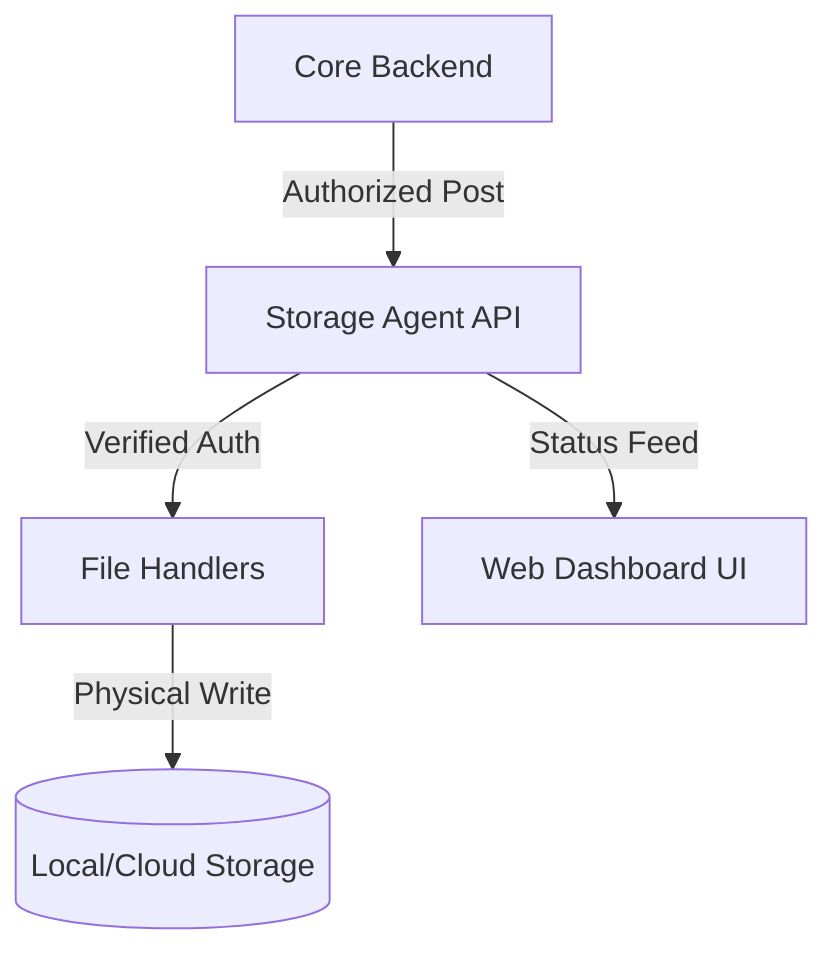

# 
📦 TargetUp - Distributed Storage Agent

  
  
  
  

---

## 💎 Overview
The **Storage Agent** is a specialized high-performance node designed to handle massive file ingestion, metadata management, and secure asset distribution within the **TargetUp Ecosystem**. It operates as a bridge between the Core Backend and physical storage assets.

### ⚡ Technical Capabilities
- **Secured Upload Pipeline**: Multi-part file ingestion with JWT-based identity verification.
- **Intelligent Folder Management**: Automated directory orchestration with collision avoidance.
- **Micro-UI**: Built-in monitoring dashboard accessible via local or remote web browsers.
- **Hybrid Operation**: Capable of running as a standalone server or integrated within the desktop environment.
- **Secure Diag**: Built-in diagnostic systems for firewall and connectivity repair.

---

## 🏗️ Technical Stack (A to Z)

| Layer | Technology | Purpose |
| :--- | :--- | :--- |
| **Runtime** | `Node.js` | Low-latency server execution and file stream handling. |
| **API Engine** | `Express.js` | Routing system for handling ingestion and retrieval calls. |
| **Auth Shield** | `jsonwebtoken` | Token validation to ensure only authorized nodes upload assets. |
| **Diagnostics** | `PowerShell` | System-level scripts (fix-firewall) for network orchestration. |
| **Packaging** | `Electron Builder` | Generates native installers for cross-platform deployment. |

---

## 🏗️ System Architecture

---

## 📡 Core API Inventory (A to Z)

### 📤 1. Ingestion & Retrieval
- `POST /upload`: Secure multi-part ingestion for files.
- `GET /files/:id`: authorized download and resource streaming.
- `DELETE /files/:id`: Permanent removal of enterprise assets.

### 🛠️ 2. Management & Diag
- `GET /health`: Real-time operational status heartbeat.
- `POST /verify/config`: Validation of current storage paths and permissions.
- `GET /dashboard`: Integrated visual interface for local monitoring.

### 🛡️ 3. Security Infrastructure
- **JWT Validator**: Every request is gated by a cryptographically signed token.
- **Path Sanitization**: Protection against directory traversal and unauthorized path injection.

---

*The Storage Backbone of the TargetUp Intelligent Ecosystem*

